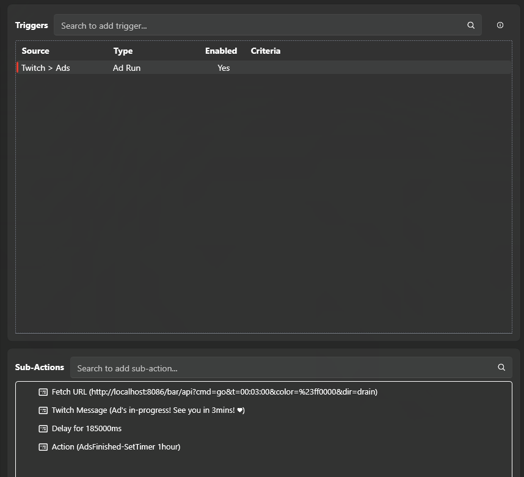
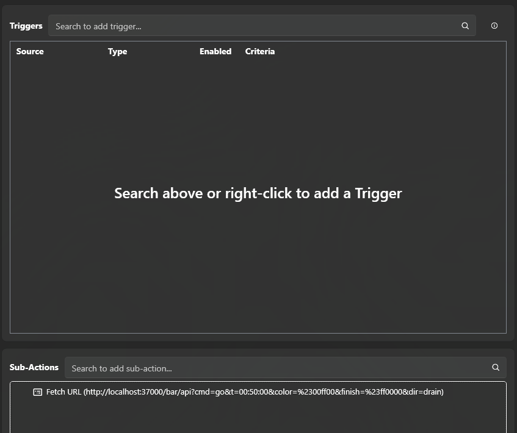
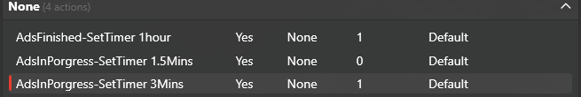

# Ad Break Timer


[](https://github.com/KaydeeCodes/StreamTools-AdBreakTimer/releases/latest)

A lightweight local web server that hosts two OBS Browser Source overlays (a bar and a radial ring) and drives them with simple URL commands. Built for Streamer.bot, but works with anything that can send an HTTP request.

No install, no database, no external files. It's one exe. Everything it needs is baked in at build time, and the only thing it writes to disk is a small `config` folder next to itself.

Made by [Kaydee.Codes](https://kaydee.codes/). Free to use, no data collected, ever.

---

## New here? You don't need to read this whole page

1. Download the latest release below and unzip it.
2. Double click `AdBreakTimer.exe`.
3. Answer the questions on screen, pressing Enter picks the normal recommended answer for every single one of them.
4. When it finishes, it tells you exactly what to paste into OBS and Streamer.bot.

That's genuinely the whole thing. Everything below this point is reference material for later, you don't need any of it to get up and running.

---

## Download

Grab the latest build from the [Releases page](https://github.com/KaydeeCodes/StreamTools-AdBreakTimer/releases/latest). Unzip it and run `AdBreakTimer.exe`, that's the entire install.

Each release includes a SHA256 checksum in its notes. If you want to verify your download wasn't tampered with:

```
certutil -hashfile AdBreakTimer.exe SHA256
```

Compare the output against the hash listed on the release page.

Prefer to build it yourself instead? See [Building from source](#building-from-source).

---

## Contents

- [New here?](#new-here-you-dont-need-to-read-this-whole-page)
- [Download](#download)
- [Features](#features)
- [Quick start](#quick-start)
- [Copy-paste examples](#copy-paste-examples)
- [Building from source](#building-from-source)
- [OBS setup](#obs-setup)
- [Config files](#config-files)
- [Debug levels](#debug-levels)
- [API reference](#api-reference)
  - [The `go` command](#the-go-command)
  - [General commands](#general-commands)
  - [Bar only commands](#bar-only-commands)
  - [Radial only commands](#radial-only-commands)
  - [Response format](#response-format)
- [Behaviour when a countdown finishes](#behaviour-when-a-countdown-finishes)
- [Streamer.bot setup](#streamerbot-setup)
- [Troubleshooting](#troubleshooting)
- [Licence](#licence)

---

## Features

- **Two overlays in one exe.** A bottom progress bar and a circular progress ring, each independently controlled with its own config and its own API.
- **Guided first-time setup.** An interactive wizard walks through picking a port, adding it to OBS, testing it, and generating ready-to-paste Streamer.bot commands based on your actual Twitch ad timing, no manual configuration needed.
- **Fully responsive.** No fixed canvas size. Resize the OBS Browser Source to whatever dimensions you want and both overlays fill it correctly.
- **Automatic port handling.** Tries the last known good port first, walks upward if it's taken, and remembers the working port for next time.
- **One-shot control.** A single `go` command sets the colour, direction, and duration and starts the countdown, instead of chaining several requests together.
- **Self-healing finish state.** When a countdown hits zero, the overlay flashes full width or a full ring in the finish colour for a configurable duration, then automatically clears itself back to idle. It never gets stuck lit up if the next command is late.
- **Readable console output.** Real events only (start, stop, pause, config changes, errors) with colour coding, and any colour value referenced in a log line prints in that actual colour. The constant 5x/second status polling from the overlay pages stays silent unless you turn debug logging up.
- **Timing diagnostics built in.** Every countdown start states the clock time it's due to finish at, and flags it if a new command interrupted one that still had time left, so a countdown finishing at the wrong time is easy to actually pin down.
- **A log file for support.** `config/latest.log` is overwritten fresh every run and always captures full detail, so if someone hits an issue the fix is just "send me that file".
- **No telemetry.** Nothing is sent anywhere except localhost.

---

## Quick start

1. Download or build `AdBreakTimer.exe` (see [Building from source](#building-from-source)).
2. Run it. The first time, a setup wizard walks you through everything, four short steps:
   - Pick a port (press Enter, recommended, it picks one for you)
   - Pick a style, the bar or the ring (press Enter for the bar, it's the recommended default)
   - Add it to OBS following the exact on-screen steps, then confirm it's actually moving
   - Answer two questions about your Twitch ad timing, or just press Enter twice for typical defaults

That's it, no manual editing required. At the end it writes out the exact commands to paste into Streamer.bot, saved to `config/streamerbot-setup.txt` so you can find them again later without redoing anything.

Want to redo the wizard later, e.g. Twitch changed your ad timing, or you want to try the other overlay style?

```
AdBreakTimer.exe --setup
```

Prefer to skip the wizard and do it all by hand instead? See [OBS setup](#obs-setup) and [Streamer.bot setup](#streamerbot-setup) below.

---

## Copy-paste examples

The setup wizard generates commands built around your exact port and ad timing, that's always the best option. But if you'd rather skip straight to pasting something in and adjusting later, here are ready-made examples for common Twitch ad setups. Replace `37000` with your actual port if it's different (the console tells you on startup).

**3 minute ad breaks, roughly 1 hour apart** (a common default):

```
Ad break starts: http://localhost:37000/bar/api?cmd=go&t=3:00&color=%23ff0000&dir=drain
Ad break ends:   http://localhost:37000/bar/api?cmd=go&t=1:00:00&color=%2300ff00&finish=%23ff0000&dir=drain
```

**2 minute ad breaks, roughly 30 minutes apart**:

```
Ad break starts: http://localhost:37000/bar/api?cmd=go&t=2:00&color=%23ff0000&dir=drain
Ad break ends:   http://localhost:37000/bar/api?cmd=go&t=30:00&color=%2300ff00&finish=%23ff0000&dir=drain
```

**Using the radial ring instead of the bar?** Swap `/bar/api` for `/radial/api` in any of the above, everything else stays the same.

**Just want to see it working right now**, without touching Streamer.bot at all? Paste this into any web browser's address bar while the exe is running:

```
http://localhost:37000/bar/api?cmd=go&t=0:30&color=%2300ff00&finish=%23ff0000
```

That starts a 30 second green countdown that flashes red when it finishes.

---

## Building from source

This needs the .NET 8 SDK to build, but the resulting exe is fully self-contained and needs nothing installed to run.

```bash
# from inside the AdBreakTimer folder, the one with AdBreakTimer.csproj
dotnet publish -c Release
```

The exe lands in `bin/Release/<target framework>/win-x64/publish/AdBreakTimer.exe`. The `<target framework>` folder name depends on which .NET SDK is installed on the machine doing the build (for example `net8.0` or `net9.0`), so just look for whatever folder is actually there under `bin/Release/`. That single exe is the entire distributable, nothing else needs to travel with it.

Full walkthrough, including installing the SDK, is in [BUILD_INSTRUCTIONS.md](BUILD_INSTRUCTIONS.md).

---

## OBS setup

The setup wizard walks through this automatically on first run (see [Quick start](#quick-start)). Manual steps, if you're doing it by hand or adding a second source later:

1. Add a **Browser Source**.
2. Paste in `http://localhost:<port>/bar/` or `http://localhost:<port>/radial/`.
3. Set the Width/Height to whatever you want. Both overlays are responsive and just fill the space they're given, there's no resolution to match.
4. Turn **off** "Shutdown source when not visible" so the timer keeps running in the background even when the source isn't on screen.

---

## Config files

Everything is stored as JSON in a `config` folder next to the exe, created automatically on first run.

| File | Purpose |
|---|---|
| `config/settings.json` | Port number, console debug level, and setup wizard state |
| `config/bar.json` | Current state and settings for the bar overlay |
| `config/radial.json` | Current state and settings for the radial overlay |
| `config/README.txt` | Full setup and command guide, written once on first run |
| `config/streamerbot-setup.txt` | The exact Streamer.bot commands generated by the setup wizard |
| `config/latest.log` | A plain text log of everything that happened, overwritten fresh every time the exe starts. See [Troubleshooting](#troubleshooting) if someone's asking you to send this over |

These can be hand-edited while the exe is **not** running if you want to change a default without sending an API call.

---

## Debug levels

Set via `debugLevel` in `config/settings.json`, or live at runtime.

| Level | Shows |
|---|---|
| **1** (default) | Real events only: start, pause, stop, config changes, errors, and when a countdown finishes naturally. This is what ships to end users. |
| **2** | Everything in level 1, plus the raw command and query string behind every event, the full resulting state, config load/parse failures, and full exception stack traces. |
| **3** | Everything in level 2, plus every single HTTP request including the constant status polling. Very noisy, only useful for debugging the polling itself. |

Change it three ways:

```bash
# 1. Edit the config file and restart
config/settings.json  ->  "debugLevel": 2

# 2. While it's running, hit this URL (takes effect immediately and saves)
http://localhost:37000/debug/set?level=2

# 3. One-off, without saving the change
AdBreakTimer.exe --debug 3
```

---

## API reference

Base URL is whatever the console prints on startup, `http://localhost:<port>`.

Every command below is a `GET` request and works on both endpoints unless marked otherwise:

```
/bar/api?cmd=...
/radial/api?cmd=...
```

Colours need to be URL encoded if using `#`. `%23` is `#`, so `#ff0000` becomes `%23ff0000`. Bare hex without the `#` also works now (`v=ff0000` is fine on its own), and so do common CSS color names, `rgb()`, `rgba()`, `hsl()`, `hsla()`, and `transparent`.

Every time a colour shows up in the console log, it prints in that actual colour (or the nearest of the console's 16 colours it can manage), so running `cmd=setcolor&v=%2300ff00` prints `#00ff00` in green, not plain white text.

### The `go` command

This is the one command you'll use most. It sets whatever parameters you give it and starts the countdown immediately, replacing what would otherwise be four or five separate requests.

```
GET /bar/api?cmd=go&t=01:00:00&color=%2300ff00&finish=%23ff0000&dir=drain&flash=on&flashfor=30
```

| Parameter | Required | Description |
|---|---|---|
| `t` | Yes | Duration. Accepts `hh:mm:ss`, `mm:ss`, or raw seconds. |
| `color` | No | Running colour, URL encoded. |
| `finish` | No | Colour it switches to when the countdown hits zero. |
| `dir` | No | Bar: `drain` or `fill`. Radial: `cw` or `ccw`. |
| `flash` | No | `on` or `off`, whether it flashes when finished. |
| `flashfor` | No | Seconds to flash before auto-clearing to idle. Default 30. |

### General commands

These work on both `/bar/api` and `/radial/api`.

| Command | Parameters | Description |
|---|---|---|
| `cmd=start` | none | Starts or resumes the countdown from the current remaining time. |
| `cmd=pause` | none | Pauses without losing remaining time. |
| `cmd=stop` | none | Stops and clears the remaining time to zero. |
| `cmd=reset` | none | Returns to the initial time set, stays idle (does not auto-start). |
| `cmd=status` | none | Returns the current state. Used internally by the overlay pages, five times a second. |
| `cmd=settime` | `t` | Sets the duration without starting it. |
| `cmd=addtime` | `s` (seconds) | Adds time to the current countdown. |
| `cmd=subtime` | `s` (seconds) | Removes time from the current countdown. |
| `cmd=setcolor` | `v` (colour) | Sets the running colour. |
| `cmd=setfinishcolor` | `v` (colour) | Sets the colour used when the countdown hits zero. |
| `cmd=setbgcolor` | `v` (colour, or `transparent`) | Sets the page background colour. |
| `cmd=setflash` | `v` (`on`/`off`) | Turns the finish flash animation on or off. |
| `cmd=setflashduration` | `v` (seconds) | How long it flashes before auto-clearing to idle. |

### Bar only commands

| Command | Parameters | Description |
|---|---|---|
| `cmd=setdirection` | `v` (`drain`/`fill`) | `drain` starts full and shrinks, `fill` starts empty and grows. |
| `cmd=setbarheight` | `v` (pixels) | Height of the bar. Default `5`. |
| `cmd=setbarwidth` | `v` (CSS width, e.g. `100%`) | Width of the bar track. |

### Radial only commands

| Command | Parameters | Description |
|---|---|---|
| `cmd=setdirection` | `v` (`cw`/`ccw`) | Sweep direction. |
| `cmd=setsize` | `v` (5 to 100) | Diameter as a percentage of the viewport's smaller side. Default `60`. This is what makes the ring scale as the Browser Source is resized. |
| `cmd=setthickness` | `v` (1 to 50) | Ring stroke width as a percentage of the diameter. Default `7`. |
| `cmd=settrackcolor` | `v` (colour) | Colour of the unfilled background ring. |

### Response format

Every request returns JSON.

Success (state is trimmed here for readability, the real response includes every field for that overlay type, e.g. `barHeight`/`barWidth` for the bar or `size`/`thickness`/`trackColor` for the radial):

```json
{
  "ok": true,
  "cmd": "go",
  "state": {
    "remaining": 1800,
    "initialTime": 1800,
    "status": "running",
    "color": "#00ff00",
    "finishColor": "#ff0000",
    "direction": "drain",
    "flashOnFinish": true,
    "flashDuration": 30
  }
}
```

Failure:

```json
{
  "ok": false,
  "error": "Time must be greater than zero."
}
```

---

## Behaviour when a countdown finishes

The instant a countdown hits zero, the overlay snaps to full (the whole bar, or a fully drawn ring) in the finish colour and flashes for `flashDuration` seconds. If nothing tells it what to do next before that duration is up, it automatically reverts to idle (invisible) on its own. It is never left stuck lit up waiting for the next command.

---

## Streamer.bot setup

A typical hour-long ad break cycle with a 3-minute ad break in the middle, as a chain of `go` calls:

```
# When the previous ad break finishes, start a 1-hour countdown to the next one
GET http://localhost:37000/bar/api?cmd=go&t=01:00:00&color=%2300ff00&finish=%23ff0000&dir=drain

# When Streamer.bot detects the 3-minute ad break starting
GET http://localhost:37000/bar/api?cmd=go&t=00:03:00&color=%23ff0000&dir=drain

# When that ad break's Streamer.bot timer ends, back to the normal 1-hour countdown
GET http://localhost:37000/bar/api?cmd=go&t=01:00:00&color=%2300ff00&finish=%23ff0000&dir=drain
```

If a command is sent a little late, the overlay just flashes red at zero and clears itself, no manual cleanup needed. See [Behaviour when a countdown finishes](#behaviour-when-a-countdown-finishes).

Here's what that actually looks like set up as two chained actions in Streamer.bot.

### Action 1: AdsInProgress, triggered by the ad starting

Trigger: **Twitch > Ads > Ad Run**

Sub-actions, in order:

1. **Fetch URL**: `http://localhost:37000/bar/api?cmd=go&t=00:03:00&color=%23ff0000&dir=drain`, starts the red 3-minute countdown
2. **Twitch Message**: a heads up in chat, e.g. "Ad's in-progress! See you in 3mins!"
3. **Delay**: `185000` ms, a little longer than the ad break itself, as a buffer
4. **Action**: calls Action 2 below to re-arm the long countdown



### Action 2: AdsFinished, chained from Action 1

No trigger of its own, this one only ever runs when Action 1's last sub-action calls it.

Sub-actions:

1. **Fetch URL**: `http://localhost:37000/bar/api?cmd=go&t=01:00:00&color=%2300ff00&finish=%23ff0000&dir=drain`, starts the green countdown to the next ad break



Both actions sit together in Streamer.bot's action list once set up:



### Adding the Fetch URL sub-action

In Streamer.bot, search for **Fetch URL** when adding a new sub-action, paste the full `go` command as the URL, and leave the method as `GET`. No headers or request body needed.

### Why the delay is longer than the ad break

Streamer.bot's own `Delay` timer and the countdown running inside Ad Break Timer are two separate clocks. They don't need to match exactly, if the delay finishes a few seconds before or after the overlay's countdown actually hits zero, the overlay just flashes its finish colour and quietly clears itself once it does reach zero, so a little drift never looks broken on stream.

---

## Troubleshooting

**If someone's having an issue and asking me for help, the easiest thing is `config/latest.log`.** It's overwritten fresh every time the exe starts, and captures more detail than the console shows by default (raw commands, resulting state, full error detail), so I don't need them to have turned on debug logging beforehand. Every line's timestamped too, which makes timing issues (a countdown finishing earlier or later than expected) easy to actually pin down instead of guessing.

Every "Started" line in the console and log also states the clock time it's due to finish at (e.g. `finishes around 14:32:05`), and flags it if a `go` command interrupted a countdown that still had real time left on it. If a bar or ring isn't finishing when you expect, that's the first thing to check, compare the "finishes around" time against when it actually flashed.

| Problem | Fix |
|---|---|
| A countdown isn't finishing when expected | Check `config/latest.log` for the "Started... finishes around HH:mm:ss" line and compare it against when it actually flashed. If you see "(was still running with X left before this)" on a `go` line, something sent a new command before the previous countdown was meant to end, that's almost always a Streamer.bot trigger firing more than once or overlapping timing rather than an app issue. |
| Lost the Streamer.bot commands | They're saved in `config/streamerbot-setup.txt`, or run `AdBreakTimer.exe --setup` to regenerate them. |
| Twitch ad timing changed | Run `AdBreakTimer.exe --setup` to redo the wizard with new numbers. |
| The wizard opened a browser tab that just keeps loading | Make sure you're on v1.1.0 or later, this was a real bug in earlier builds where the server hadn't fully started before the wizard tried to test it. Update to the latest release. |
| Nothing shows up in OBS | Check the console window is still open and shows "running". Confirm the port in the URL matches what the console printed. |
| Bar or ring never moves | Make sure `cmd=go` was called, or `cmd=settime` followed by `cmd=start`. `cmd=status` alone does not start anything. |
| Console is too noisy or too quiet | Adjust the debug level, see [Debug levels](#debug-levels). This only affects the console, `config/latest.log` always captures full detail regardless. |
| Want to change a default without an API call | Edit `config/bar.json` or `config/radial.json` directly while the exe is not running. |
| Built exe is small (under 1MB) with a separate `.dll` next to it | That's a `dotnet build`, not a publish. Run `dotnet publish -c Release` and grab the exe from `bin/Release/.../publish/`, not `bin/Debug/...`. See [Building from source](#building-from-source). |
| "Embedded resource not found" when opening an overlay page | Stale build cache. Run `dotnet clean` then `dotnet publish -c Release` again. |

---

## Licence

Free to use, modify, and share. No attribution required, though it's appreciated. No warranty, use at your own risk.

---

Made by [Kaydee.Codes](https://kaydee.codes/). Free to use, no data collected, ever.
